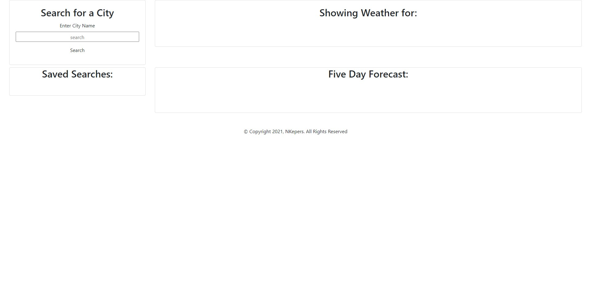

# WeatherDashboard

## Description
HTML 
• Used to create elements for each section regarding city searches and weather displays.
• Optimized code by using Bootstrap classes to be able to organize the content with the html file. 

CSS
• Used Bootstrap to customize buttons, dates and icons. 

Javascript
• Created an interactive weather dashboard where you can enter city names and get the current weather display plus an additional 5 day forecast.
• UV index presented with a color that indicates whether the conditions are favorable, moderate, or severe.

## Production Website

[Weather Dashboard](https://nkepers.github.io/weatherDashboard/ "Weather Dashboard")

## Usage
What your site will look like on your device

## Credits

To give thanks to all who have helped create this product.

[University of Arizona Bootcamp](https://courses.bootcampspot.com "UofA")

[MDN Web DOCs](https://developer.mozilla.org/en-US/docs/Web/HTML/Element/aside "MDN")

## License

©Copyright 2021,  All Rights Reserved